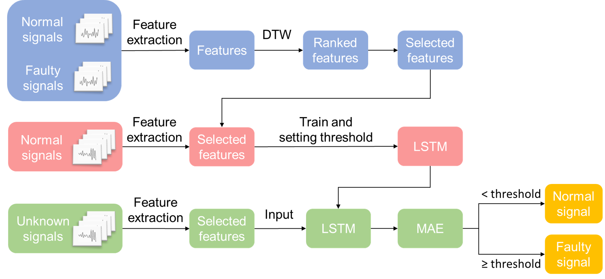

# 我的硕士毕设

这是我为硕士毕设创建的项目，虽然毕设的主要内容之前都已经完成了，但我希望借助这次机会，体验创建项目的整个过程。

希望实现的目标包括：

- [x] 使用逻辑清晰、通用性的的项目结构模板来管理脚本
- [x] 使用yacs、ignite这样的深度学习高级管理工具
- [x] 使用日志管理库loguru来合理的记录日志

## 内容简介

本项目旨在实现根据轴承振动信号识别故障以及判断故障程度，识别故障的思路流程图如下



详细思路见我的[论文](resource/doc/paper.docx)。之后我也会在这里补充项目简介。

## 代码框架

使用的模板来自[这里](https://github.com/DuskSwan/Deep-Learning-Project-Template)，尽管我保留了模板的README，但在实现中我会有自己的理解与调整，所以在这里写明。

原本的模板结构见README_template.md。经过我修改的结构如下：

```text
├──  config
│    └── __init__.py
│    └── default.py
|       通用的参数配置，最终使用的是defaults.py中的类cfg
│    └── data_usage.yml
|       实验中需要更改的配置选项
│ 
│
├──  data
│    └── __init__.py
│    └── datasets
|       该目录存放数据集，理想状态下，其中没有其他脚本。
│    └── build.py
|       给出dataloader和mini-batch
│
│
├──  engine
│    ├── trainer.py     - this file contains the train loops.
│    └── inference.py   - this file contains the inference process.
|       给出训练与测试的函数
│
│
├──  modeling
│    └── __init__.py
│    └── LSTM.py
|       给出模型和定制的层
│
├──  solver
│    └── __init__.py
│    └── build.py
|       定制求解器，包括优化器、学习率变化器等。
│ 
├──  run			- 会实际运行的脚本放在这里
│    └── train_net.py  
│    └── test.py
│    └── tools.py
|		tools放了一些封装层次很高的函数，仅仅用于训练和测试		
|       
│ 
└──  utils
│    ├── __init__.py
│    └── feature.py
│    └── similarity.py
│    └── threshold.py
|       实用工具。在本项目中，需要特征提取、计算相似性、计算阈值等工具。
│ 
└──  log				- 存放日志
|    └── CWRU_train_2023-12-19-20-06-35.log
│ 
└──  output				- 存放输出内容，比如训练好的模型
     └── cwru_ltsm.pth
         
```

## 详细思路讲解

该算法希望给出一种基于发动机振动信号的故障诊断方法。按照设想，故障诊断（判断是否故障）、故障检测（判断故障出现的时间点）、故障程度评估都是能做的，目前只实现了故障诊断。

该方法的核心思路是采用时间序列预测模型来预测从正常信号中提取的特征序列。与预测一致的信号被视为正常，而与预测值相差较大则表明信号存在故障，偏差越大表示故障越严重。具体分为以下几个步骤：

### 1、利用滑窗将信号变成多个样本

设原始信号表示为$\{x_1,x_2,...,x_N\}$，其中$x_i$是一个维度为channel的向量。在程序里表示成N×channel的二维数组。需要将它变成多个信号段，每个信号段计算一个特征向量。

使用长度为sublen的滑动窗口在原始信号上依次截取，为了获取尽可能多的样本，窗口的移动步长设置为1。这样，从原始信号中可以取出至多N-sublen+1个信号段，设置要取出的数目为piece。每个信号段长度都为sublen，第$k$个样本（信号段）表示为$\{x_k,x_{k+1},...,x_{k+sublen-1}\}$，程序中是一个sublen×channel的二维数组。所有信号段组成piece×sublen×channel的三维数组。

### 2、提取特征并筛选

预设了18个可供使用的特征。定义见[论文](resource/doc/paper.docx)。需要注意的是，论文中提到的特征计算公式仅适用于一维信号，然而，真实的信号采集涉及多个测量点，其中每个测量点的数据构成一个信号通道。因此，在实际处理中，应该为信号的每个通道单独提取特征。最终的特征时间序列其维度是原始信号通道数和特征数的乘积。

对输入的信号，利用滑窗将其转化成多个信号段后，每个信号段的每个通道可以计算出channel×18个特征，也即每个信号段矩阵产生一个维度为channel×18的特征向量。于是，每个原始信号（N行channel列）转化成特征时间序列（piece行channel×18列）

如果将18维的时间序列作为预测对象，模型将很难收敛，于是我们希望筛选出一部分特征来使用。由于目标是通过预测准确率来反映是否存在故障，我们应该希望正常信号的特征时间序列和故障信号的时间序列差异很大，因此，对正常信号和故障信号提取出的每个特征，逐一计算对应特征的相似度，优先选择相似度小的特征来使用。

在相似度选择上，采用动态时间规整(DTW)算法，逐列计算两特征矩阵的DTW得分。值得注意的是，针对某个特征（如均值Mean），由于在每个通道上都会计算出一个序列（假设有三个通道，就存在chn1_Mean, chn2_Mean, chn3_Mean），因此每个通道都有对应的DTW得分，我们取每个通道得分之和作为这个特征的最终得分。

将特征按分数由高到低排序，就得到了特征的选用顺序。一般来说，选第一个特征就足以区分正常与故障信号。

### 3、建立预测模型

假设筛选的特征仅为均值“Mean”。接下来要构建特征序列样本用于训练模型。

再次应用滑动窗口，在正常信号的特征矩阵上截取出用于训练LSTM预测模型的特征序列样本矩阵。LSTM模型旨在基于序列中前$m$个点（特征向量）预测接下来$p$个点（特征向量）的值，因此滑动窗口长度设置为fsublen=m+p。滑动步长仍然为1。要求训练数据集至少包含fpiece个样本，因此特征时间序列的长度piece要保证大于等于fsublen+fpiece-1。

每个特征序列样本是fsublen行channel列的矩阵（若选用两个特征，则是channel×2列），用前m行channel列作为该样本的输入、后p行channel列作为输出，用共fpiece个样本，训练时间序列预测模型，这里我用的是一个简单的LSTM层+全连接层的网络。

### 4、计算判别阈值

给定训练好的模型，对任何一段原始信号，经过滑窗得到信号样本集，再经过特征提取得到特征时间序列，再次通过滑窗得到特征时间序列样本，输入模型，可以计算出真实值与模型的输出也即预测值的误差得分。我们采用平均绝对误差MAE作为误差得分的衡量指标。

对每一个样本，预测值与真实值都是p行channel列的数组，计算出一个MAE。将正常信号提取出的一系列特征序列样本输入预测模型，得到多个MAE。它们均为”正常信号MAE分布“中的实例。对一个未知信号，如果计算出的MAE属于来自”正常信号MAE分布“，那么该信号是正常的，否则故障。而且故障信号的MAE相比正常信号的MAE一定偏大。

于是，故障判断转化成了一个假设检验问题，设原假设$H_0$：未知信号的MAE属于”正常信号MAE分布“，如果有把握否定原假设，则判定未知信号是故障的，否则正常。希望找到一个合适的统计量作为阈值，当未知信号的MAE大于此阈值时则否定原假设。

对于正态分布，通常采用μ+3σ作为检验异常值的标准。但实验表明，正常信号MAE并非服从正态分布。对于偏态分布，有以下策略：1.取对数使之数据变成正态分布；2.采用基于IQR的修改后的Z-分数；3.采用p-分位数；4.采用箱线图。

经过实验验证，基于IQR的修改后的Z-分数效果最好。其计算公式为$ Z = \frac{x−x_M} {IQR / 1.349}$ ，其中$x_M$是已知数据的中位数，IQR是已知数据的第三四分位数（Q3）与第一四分位数（Q1）之差，如果数据点$x$所计算出的分数$Z>3.5$则认为$x$为异常点。由此算出阈值$\lambda=x_M+3.5IQR/1.349$，若$x>\lambda$则认为$x$异常。

### 5、对未知信号进行预测

对一段未知信号，经过滑窗得到信号样本集，再经过特征提取得到特征时间序列，再次通过滑窗得到特征时间序列样本，输入模型，计算出预测值的MAE。每个样本都会得到一个MAE，取均值作为衡量指标。如果该指标大于阈值，则判定该未知信号故障，否则正常。
